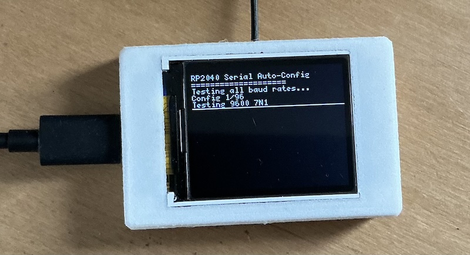

# Serial Auto-Configuration for RP2040 with RGB Display

A MicroPython program for the Raspberry Pi Pico (RP2040) that automatically detects and configures serial communication settings, with real-time display output on a 128x160 RGB display via SPI.



## Features

- **Persistent Configuration Storage**: Saves working configurations to filesystem for faster startup
- **Automatic Serial Detection**: Tests multiple baud rates and serial configurations
- **Real-time Display Output**: Shows all status and received data on a 128x160 RGB display
- **Visual Feedback**: Uses WS2812 RGB LED to indicate progress and status

## Hardware Requirements

- Raspberry Pi Pico (RP2040) or compatible board
- Serial device connected to UART pins
- 128x160 RGB display connected via SPI (e.g., ST7735)

## Housing
**3D Printing**: The housing can be 3D printed using the provided `case.stl` file.


## Pin Configuration

### UART Pins
- **RX Pin**: GPIO 1 (Pin 2)
- **Ground**: GPIO 4 (Pin 6) - Fixed low state, used as ground connection for serial I/O

### Display Pins (SPI)
- **SPI SCK**: GPIO 2 (Pin 4) - Fixed by SPI interface
- **SPI MOSI**: GPIO 3 (Pin 5) - Fixed by SPI interface
- **DC Pin**: GPIO 5 (Pin 7) - Data/Command control
- **CS Pin**: GPIO 6 (Pin 9) - Chip Select
- **RST Pin**: GPIO 7 (Pin 10) - Reset
- **BL Pin**: GPIO 8 (Pin 11) - Backlight control (PWM, default 50% brightness)

## Installation

1. Install https://micropython.org/download/RPI_PICO/
2. Copy `main.py` to your RP2040 board
3. Copy the font files (`ezFBfont.py` and `ezFBfont_5x7_ascii_07.py`) to your board
4. Connect the RGB display to the SPI pins
5. Connect your serial device to the UART pins
6. Reset the board to run the program automatically

## How It Works

### 1. Configuration Loading
The program first attempts to load a previously saved configuration from `serial_config.json`. If a valid configuration exists, it tests it immediately.

### 2. Configuration Testing
If no stored configuration is found or the stored configuration fails:
- Tests all standard baud rates: 9600, 19200, 38400, 57600, 115200, 230400, 460800, 921600
- Tests different data bits: 7, 8
- Tests different parity settings: None, Even, Odd
- Tests different stop bits: 1, 2
- Total: 96 different configurations

### 3. Text Validation
For each configuration tested:
- Waits for incoming serial data
- Validates that at least 85% of received characters are printable text
- Only considers a configuration successful if valid text is received

### 4. Configuration Storage
When a working configuration is found:
- Saves the configuration to `serial_config.json`
- Displays the configuration details on the RGB display
- Shows sample received data

### 5. Continuous Monitoring
Once a working configuration is found:
- Recreates the UART with the working settings
- Continuously monitors incoming serial data
- Displays received text on the RGB display in real-time

## LED Status Indicators

- **Green**: Working configuration found
- **Orange (blinking)**: Testing configurations
- **Cyan**: Monitoring mode (receiving data)
- **Red**: Error or no configuration found


## Testing

### Display Testing
Run `test/display_test.py` to verify your RGB display connections and functionality:
```bash
# Upload to your RP2040 and run
python test/display_test.py
```

### Serial Testing
Use `test/test_serial_local.py` on your computer to send test data to the RP2040:
```bash
# Install pyserial if needed
pip install pyserial

# Run the test script (modify the port as needed)
python test/test_serial_local.py
```

## License

This project is open source and available under the MIT License.

## Contributing

Feel free to submit issues and enhancement requests! 